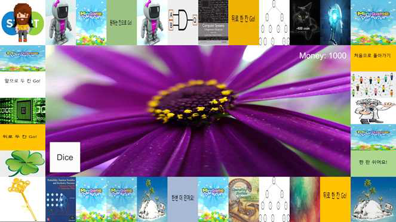
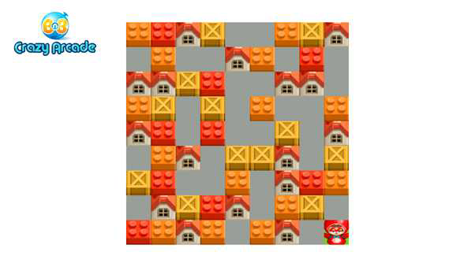

# 유니티 마블 게임

![language-c#][language-c#]
![library-unity][library-unity]
![platform-pc][platform-pc]
 
![participants-duo][participants-duo]
 
[![institution-kaist][kaist-image]][kaist-cs-url]
[![course-immersion-camp][course-cs496]][course-cs496-url]
![grade-s][grade-s]

> 미니게임을 통해 얻은 돈으로 보드판의 과목들을 이수하여 먼저 졸업하는 것을 목표로 하는 멀티플레이어 보드게임입니다.

### 스크린샷

### 개발 기간

2019년 7월 16일 - 7월 26일 (10일간)

### 기획서

[마블 게임 기획서](static/document.pdf)

### 라이선스 및 공동체 수정

이곳은 개인 프로젝트 백업을 목적으로 하는 저장소입니다.

  * 모든 제3자 사용을 허가하지 않습니다.
  * 모든 제3자 수정을 승인하지 않습니다.
    * 깃허브 Pull Request를 받지 않습니다.

<!-- Image definitions -->
[kaist-image]: https://img.shields.io/badge/Institution-KAIST-blue
[kaist-cs-url]: https://cs.kaist.ac.kr
[course-cs496]: https://img.shields.io/badge/Course-Immersion%20Camp-brightgreen
[course-cs496-url]: https://madcamp.io
[language-c#]: https://img.shields.io/badge/Language-C%23-orange
[library-unity]: https://img.shields.io/badge/Library-Unity-green
[platform-pc]: https://img.shields.io/badge/Platform-PC-yellowgreen
[grade-s]: https://img.shields.io/badge/Grade-S-yellow
[participants-duo]: https://img.shields.io/badge/Participants-Duo%20Project-7aa3cc
